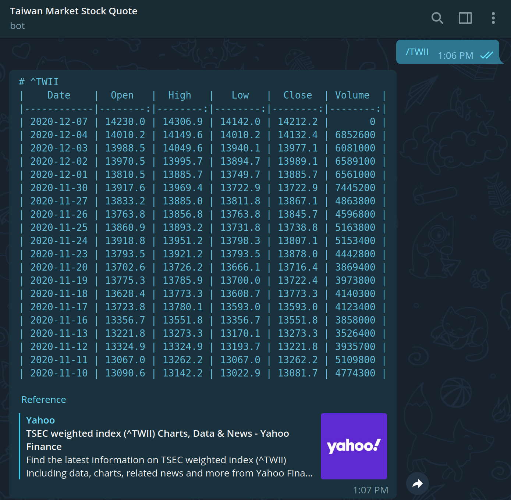
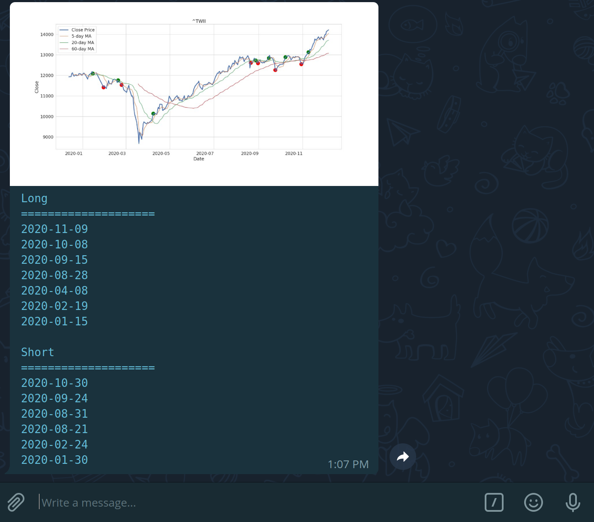

# Market Stock Quote Telegram Bot

This bot is the third-party application that runs inside Telegram.
You can interact with this bot to query the market stock quote from Taiwan.
Futhurmore, users will receive simple long-short signals generated from the bot.

 

# Requirements

The only needed one is to install the [Telegram app](https://telegram.org/) on your client.

 

# How to use

1. Invite the bot to your Telegram via this [link](https://t.me/TaiwanStockLongShortAlertBot).
2. Enter `/TWII` to query the Taiwan Capitalization Weighted Stock Index or `/[Stock Code]`, e.g. `/0050`, to query the specific stock.
3. Finally, the bot will tell you information about the stock. 😎

**NOTE**: A long signal appears when the 5-day moving average of the close price crosses above the 20-day moving average, and vice versa. **I do NOT take any responsibility for any financial gain/loss incurred due to your usage of this strategy**.

 

# Screenshots

	
	

 

# Disclaimer

- The method described above aims to illustrate the concepts to send a stock price alert via Telegram only. **I do NOT take any responsibility for any financial gain/loss incurred due to your usage of the method**.
- The stock price quote used in the script is provided by Yahoo Finance. I am NOT affiliated with Yahoo Finance in any way. I am NOT responsible for the accuracy of the price quotes either.
- I am not affiliated with Telegram in any way. I only provide a gateway for sending out Telegram messages. I cannot guarantee the gateway is functional at all times.